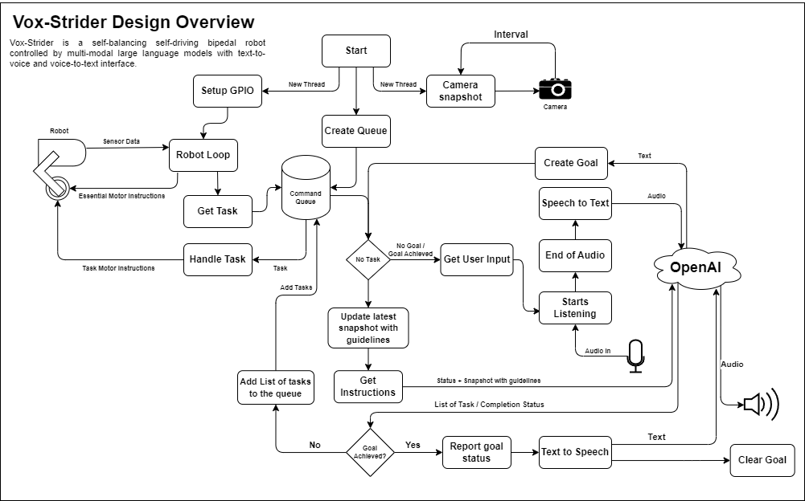

# Vox-Strider

Vox-Strider is a self-balancing self-driving bipedal robot controlled by multi-modal large language models with text-to-voice and voice-to-text interface.

## Design Overview

On start up, the robot will start balancing itself and will be ready to receive commands. The camera will take periodic snapshots to be used for object detection and navigation. The robot then will be listen for user commands. A beep sound is played both when the robot starts listening and stops listening. Once the end of speech is detected, the audio is sent to the OpenAI API for transcribing. The command is then set as the objective of the robot. The latest snapshot is modified to have guidelines indicating the general direction of the robot. The updated snapshot, the objective, and the current status of the robot is sent to OpenAI for instructions. A list of tasks are generated which will be executed by the robot one by one. Once the list of tasks is empty, the robot will prompt the OpenAI again, if OpenAI indicates that the task is completed, the robot will announce the results and will listen for further instructions.

### Simplified Design Diagram:



## Hardware Requirements
- Raspberry Pi +4
- Raspberry Pi Camera Module
- MPU-6050
- L298N Motor Driver
- 2x Servo Motors (SG90) (Currently not used)
- 2x DC Motors
- Battery Pack
- Wires
- 3D printed body + 2x Wheels

Checkout the [RESOURCES.md](RESOURCES.md) for hardware tutorials.

You can also use the playground to test your individual components.

## Installation

> **NOTE**: This project requires a Raspberry Pi with a camera module environment to run.

```bash
sudo apt-get install portaudio19-dev
pip install -r requirements.txt
```

Create `.env` file with the following content:

```bash
OPENAI_API_KEY=your_openai_api_key
TURN_OFF_MOTORS=false
TURN_OFF_CAMERA=false
TURN_OFF_PILOT=false
MANUAL_TASK_CONTROL=false
```

- `OPENAI_API_KEY`: Your OpenAI API key.
- `TURN_OFF_MOTORS`: Set to `true` to disable motor control.
- `TURN_OFF_CAMERA`: Set to `true` to disable camera.
- `TURN_OFF_PILOT`: Set to `true` to disable pilot.
- `MANUAL_TASK_CONTROL`: Set to `true` to enable manual control (You're prompted to executed each task manually)

> **NOTE**: You'd most likely need to update the configurations constants in [`src/constants.py`](src/constants.py) to match your hardware setup.

To pull the STL files, you'd need to install `git-lfs`:

```bash
sudo apt-get install git-lfs
git lfs install
git lfs pull
```

## Running

```bash
python src/main.py
```

## Renders


